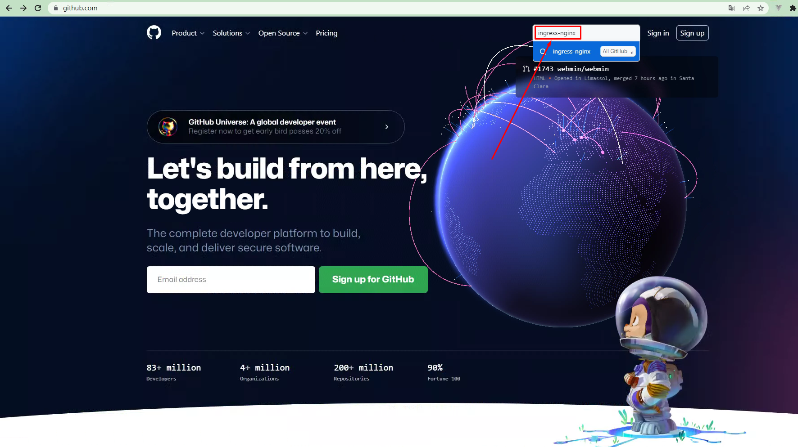
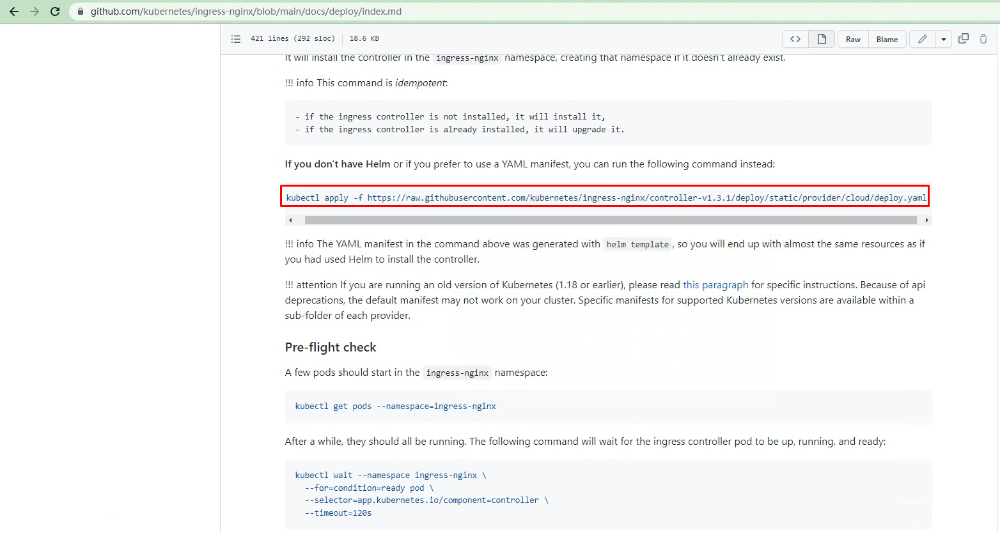

# ingress nginx controller 1.4.0 最新版本部署方法

# 一、获取ingress nginx controller

~~~powershell
# wget https://raw.githubusercontent.com/kubernetes/ingress-nginx/controller-v1.4.0/deploy/static/provider/cloud/deploy.yaml
~~~

# 二、部署ingress nginx controller

~~~powershell
# vim deploy.yaml
......

361 spec:
362   externalTrafficPolicy: Cluster  默认为local，修改为Cluster
363   ipFamilies:
364   - IPv4
365   ipFamilyPolicy: SingleStack
366   ports:
367   - appProtocol: http
368     name: http
369     port: 80
370     protocol: TCP
371     targetPort: http
372   - appProtocol: https
373     name: https
374     port: 443
375     protocol: TCP
376     targetPort: https
377   selector:
378     app.kubernetes.io/component: controller
379     app.kubernetes.io/instance: ingress-nginx
380     app.kubernetes.io/name: ingress-nginx
381   type: LoadBalancer  此处默认即为LoadBalancer,此版本不用修改。
~~~

~~~powershell
# kubectl apply -f deploy.yaml
~~~

~~~powershell
# kubectl get pods -n ingress-nginx
NAME                                       READY   STATUS      RESTARTS   AGE
ingress-nginx-admission-create-szjlp       0/1     Completed   0          13m
ingress-nginx-admission-patch-b8vnr        0/1     Completed   0          13m
ingress-nginx-controller-b4fcbcc8f-mg9vm   1/1     Running     0          13m
~~~

